# Go Dark

## User guide

### Initial Step
Fill in the following fields:\
- workspace: where the projects are stored
- git username: to push (still a feature to do) than those info are used
- git email: same as above
- max tag list size: only shows X amount of tags

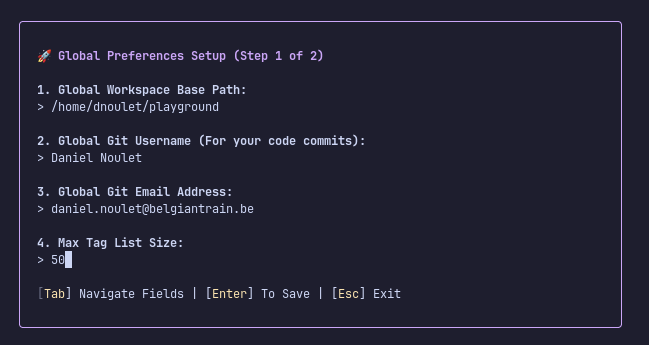

### Dashboard

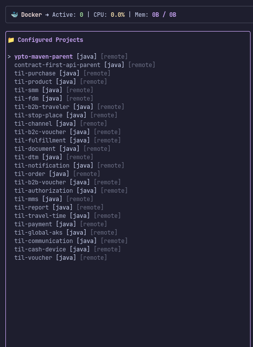

### Git

Shortcut: ctrl+g\
Select the project you want to clone\
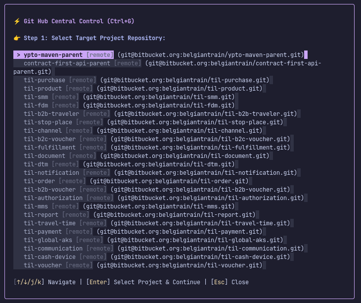

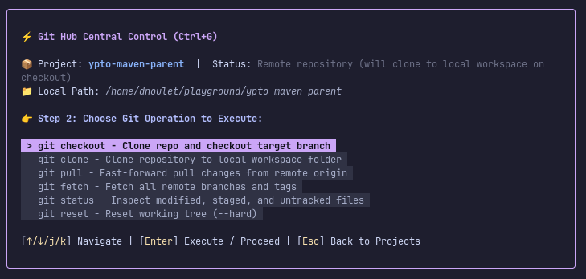\
Select the branch you want to check out\
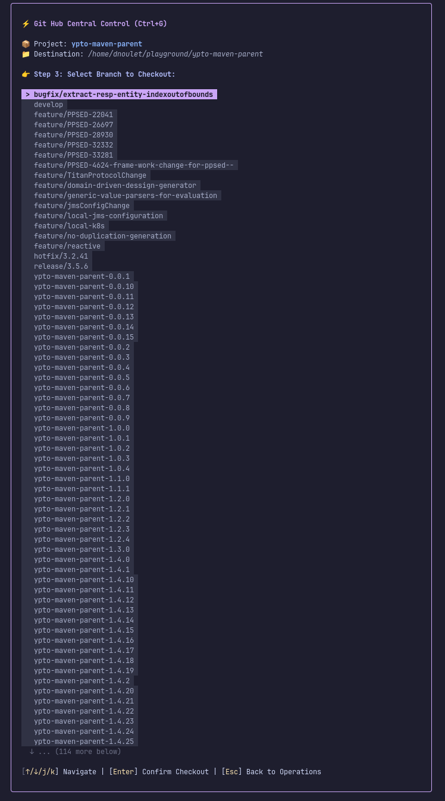

Project successfully checked out\
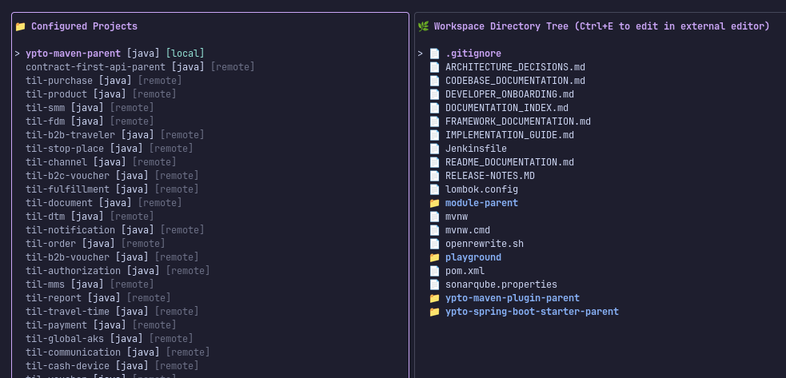


### JDK
Shortcut: ctrl+j\
You can choose between configuring a new jdk or assigning a configured one\
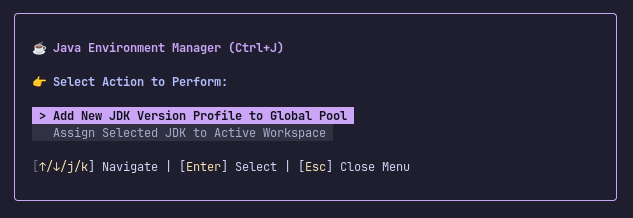
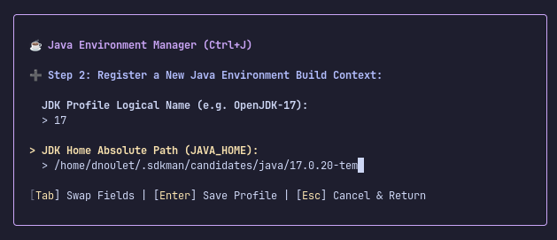
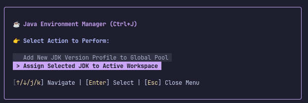
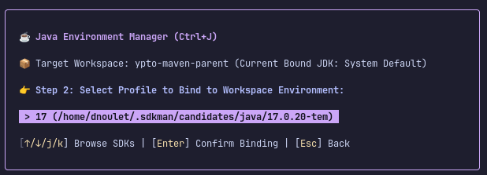


### Mvn 
Shortcut: ctrl+u\
You can choose between configuring a new mvn or assigning a configured one\
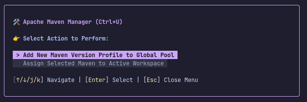
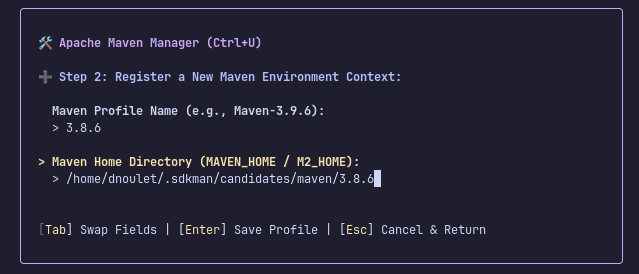
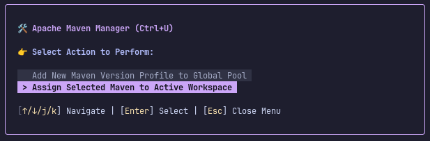
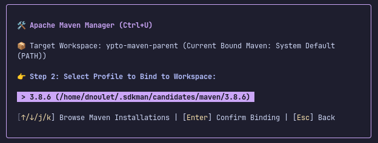

### Building project
Shortcut: ctrl+b\
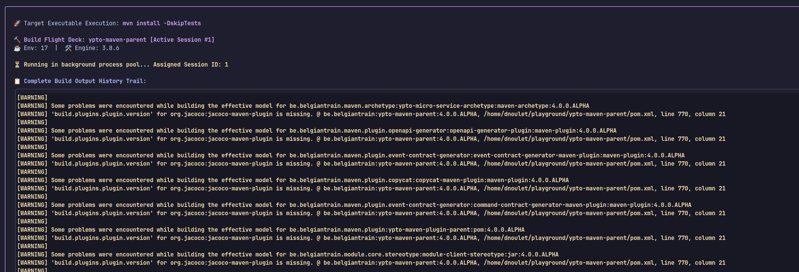\
Session runs in the background\
ctrl+s to call the screen\
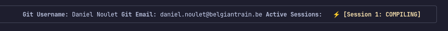
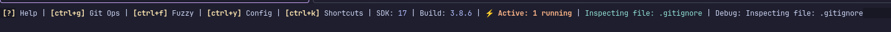


### Profile
Shortcut: ctrl+y\
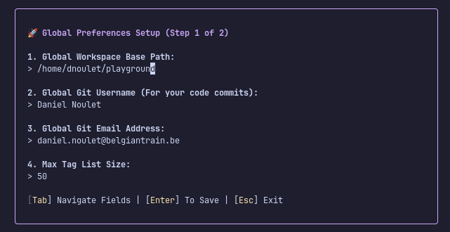
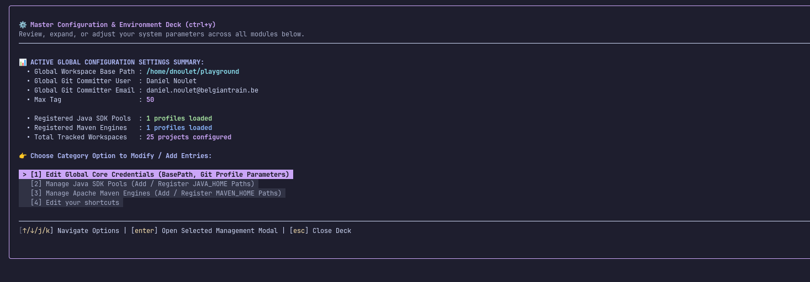

### Edit Shortcuts
Shortcut: ctrl+y\
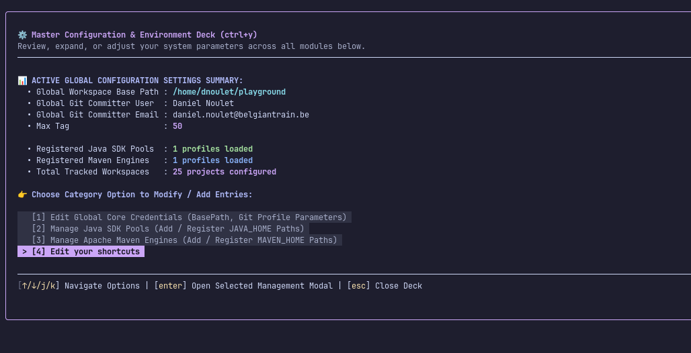
or using shortcut to go direct to the modal: ctrl+k\
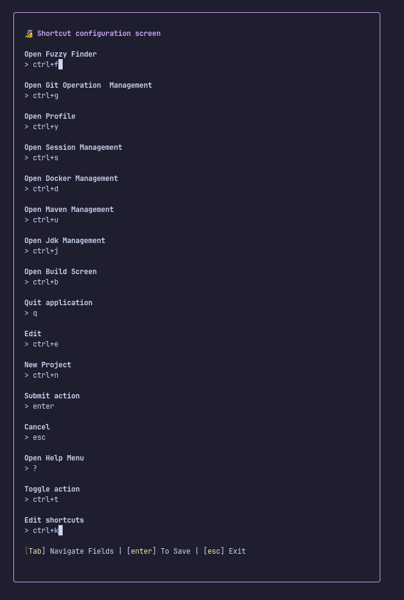
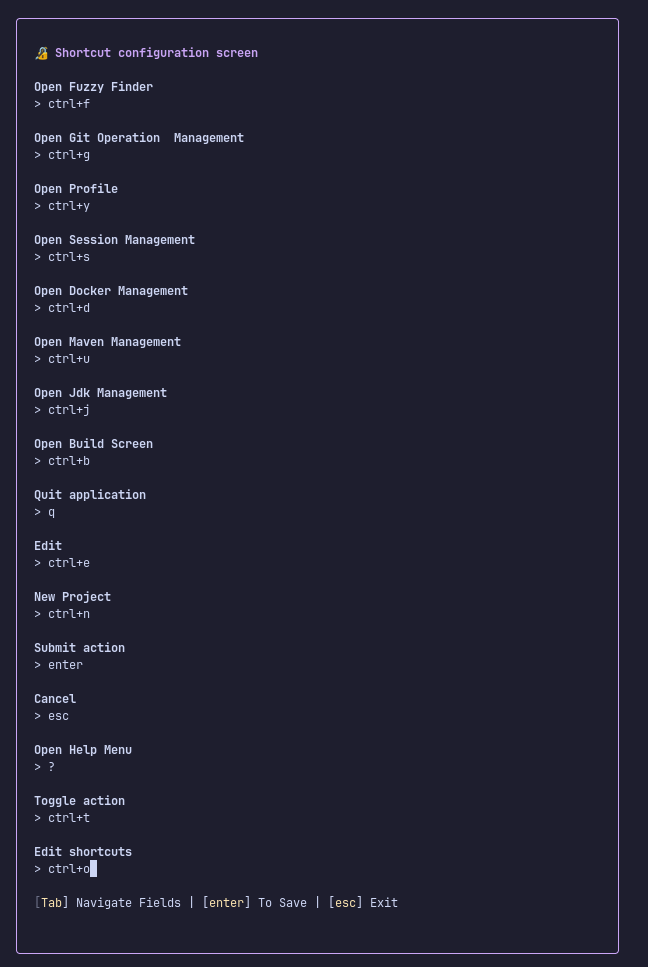
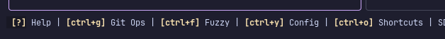

## Tech Stack

### TUI
bubble tea: https://github.com/charmbracelet/bubbletea

### Engine
go: https://go.dev/

### Run application
```bash
go run .
```

Logfile: debug.log

### Debugging

Before running this configuration, start your application and Delve as described below.

Allow Delve to compile your application:

```bash
dlv debug --headless --listen=:2345 --api-version=2 --accept-multiclient
```

Or compile the application using Go 1.18 or newer:

```bash
go build -gcflags "all=-N -l" github.com/exr462/go-dark
```

and then run it with Delve using the following command:

```bash
dlv --listen=:2345 --headless=true --api-version=2 --accept-multiclient exec ./go-dark
```